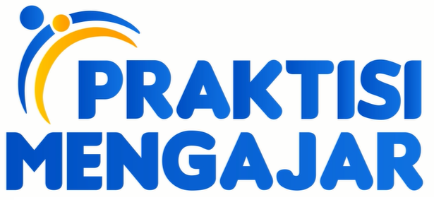

# Praktisi Mengajar - Introduction to Linguistics

 

## Tujuan

Pengenalan teknologi pengolahan bahasa  dari konsep hingga praktek sederhana menggunakan bahasa pemrograman ptyhon. Diharapkan keluaran dari kelas ini adalah awareness dari berbagai macam metodologi untuk melakukan pengolahan bahasa, dan mendapatkan bekal pengetahuan dari industri bagaimana bahasa digunakan di dalam perusahaan.

## Materi

